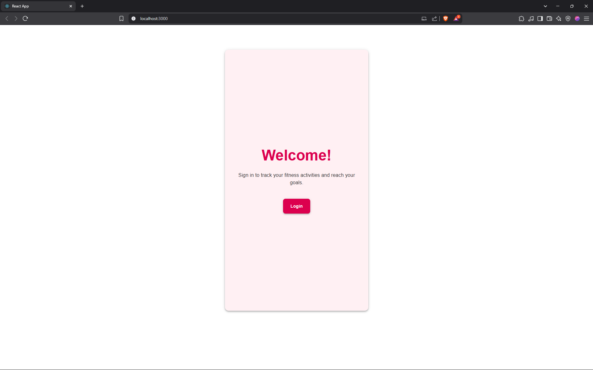
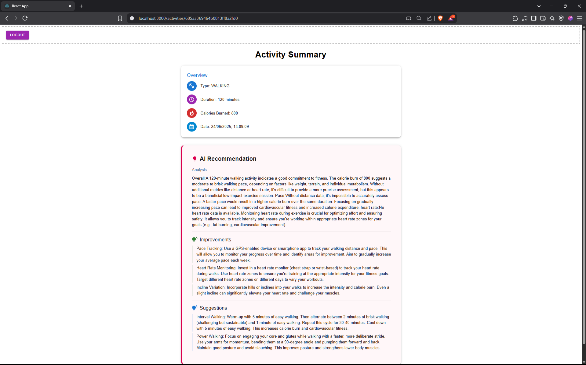

# Microservices Activity Recommendation Platform

This is a **Spring Boot-based microservices application** designed to manage users and activities, and provide AI-powered recommendations and guidelines. The architecture leverages modern cloud-native tools such as **Spring Cloud**, **Keycloak**, **PostgreSQL**, **MongoDB**, and **Google Gemini AI** to create a robust, scalable, and secure system.

---

## 🧩 Microservices Overview

| Service            | Description |
|-------------------|-------------|
| **user-service**   | Manages user data and synchronizes with Keycloak. Uses PostgreSQL for persistence. |
| **activity-service** | Handles user activities. Uses MongoDB for storing activity data. |
| **ai-service**     | Provides activity recommendations using Gemini AI. Stores recommendations in MongoDB. |
| **discovery-service** | Eureka Server to register and discover other services. |
| **api-gateway**    | Acts as the single-entry point to route external requests to services. |
| **config-server**  | Centralized configuration for all services using Spring Cloud Config. |
| **frontend**       | A simple React-based web interface for users to interact with the platform. |

---

## 🖥️ Frontend

A **React** frontend provides a user-friendly interface for:

- Signing up and logging in
- Viewing and managing user profiles
- Browsing and tracking activities
- Receiving AI-generated activity recommendations

It connects to backend services through the **API Gateway** and uses **OAuth2** to handle secure authentication via Keycloak.

---

## 🛠️ Tech Stack

- **Java 17** & **Spring Boot**
- **Spring Cloud** (Eureka, Config, Gateway)
- **React.js** – Frontend user interface
- **PostgreSQL** – User data storage
- **MongoDB** – Activity & AI recommendation storage
- **Keycloak** – Authentication & Authorization (OAuth2/OpenID Connect)
- **Spring WebClient** – For inter-service communication
- **Google Gemini AI** – For generating personalized activity recommendations

---

## 🔐 Authentication

- **Keycloak** is used for securing all microservices.
- Users in `user-service` are **synchronized** with Keycloak to ensure consistency across systems.
- The **API Gateway** validates tokens and forwards authenticated requests.

---

## 🔁 Inter-Service Communication

All microservices use **Spring WebClient** to communicate asynchronously. Service discovery is handled via **Eureka**.

---

## 🗄️ Data Storage

| Service           | Database     |
|------------------|--------------|
| user-service     | PostgreSQL   |
| activity-service | MongoDB      |
| ai-service       | MongoDB      |

---

## 🔧 Configuration

- All microservices load their configuration from the **config-server**.

---

## 🖼️ Screenshots

| Screen                                       | Description |
|----------------------------------------------|-------------|
|    | Homepage showing welcome message and navigation |
|    | Login screen integrated with Keycloak |
|    | User dashboard with recommended activities |
|  | Activity management and tracking screen |


---

## 🚀 Running the Application

### Prerequisites

- Java 17+
- Docker & Docker Compose
- Maven
- Node.js & npm (for the frontend)
- Git

### Setup

1. **Clone the Repository**
   ```bash
   git clone https://github.com/AnouarMantich/fitness-app-powered-by-gemini-ai
   cd fitness-app-powered-by-gemini-ai
